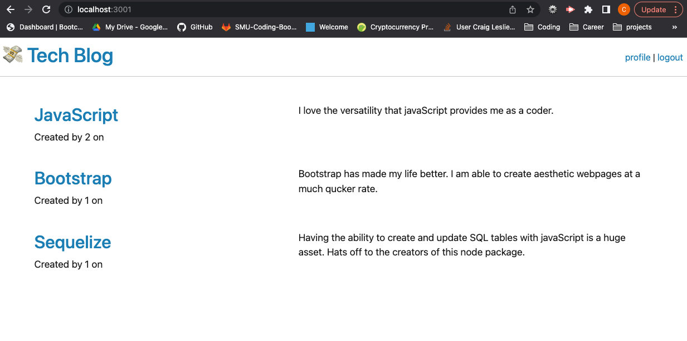

# Tech-Blog

## Description

This app allows users to login and add posts to the homepage.

------------------------------

## Table of Contents

1. [Installation](#installation)
2. [Usage Information](#usage)
3. [Contribution Guidelines](#contribution)
4. [Test Instructions](#test)
5. [Questions](#questions)
6. [License](#license)

------------------------------

## Installation 

* Type "npm install" in command line to install the node packages.
* Create a .env file.
* Run the schema in MYSQL Workbench.
* Type "node server.js" in command line to start the program.
* Open the app up in your browser.

## Usage Information 

This program's intended purpose is to provide a simple application that displays posts made by different developers. Users are free to post whatever they would like. If they wish, they can log on and delete any one of their posts by logging, navigating to their profile, and clicking the DELETE button next to that post.

## Contribution Guidelines 

* Report any bugs to the email below.
* If your code is complicated, use comments.
* Any major changes must be approved by the repo-manager.
* Be respectful.

## Test Instructions 

There are no tests created for this app.

## Screenshot

## Licenses 

* The MIT License

## Questions 

* [GitHub](github.com/3roses) 
* [Email](mailto:cleslie25@gmail.com)
